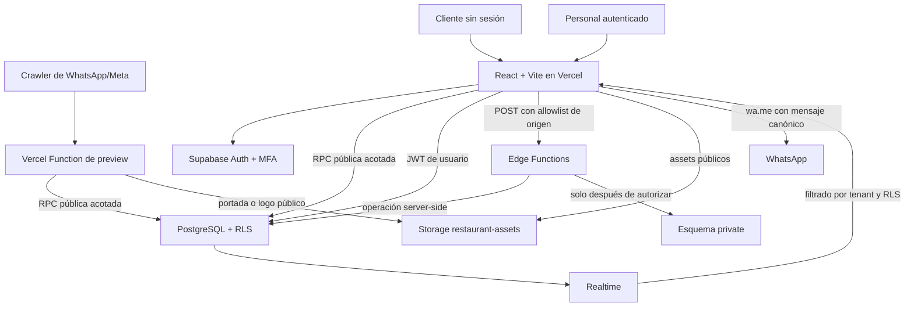

# Arquitectura

## Contexto

Mozzi Menu es una SPA multi-restaurante. Vercel entrega la aplicación estática y una Function mínima que genera metadatos Open Graph para crawlers; toda persistencia, identidad y operación privilegiada viven en Supabase. No existe un servidor Node/Express de negocio intermedio.

## Componentes

| Componente | Responsabilidad | Datos o credenciales admitidos |
|---|---|---|
| SPA | Menú, carrito local, checkout, paneles y experiencia de autenticación | URL de Supabase, publishable key, site key opcional de Turnstile y JWT de la sesión |
| Supabase Auth | Invitaciones, recuperación, sesión y factores TOTP | Identidad y factores; nunca contraseñas en tablas propias |
| PostgreSQL | Configuración, catálogo, pedidos, snapshots, auditoría y autorización final | Datos de negocio protegidos por RLS, grants y RPC |
| Esquema `private` | Tokens hasheados, rate limiting y helpers no expuestos por Data API | Solo funciones controladas y backend administrado |
| Edge Functions | Operaciones públicas endurecidas y acciones administrativas que necesitan APIs admin | Secretos inyectados por Supabase, nunca variables `VITE_*` |
| Storage | Imágenes públicas ya procesadas | WebP/JPEG/PNG bajo una ruta con `restaurant_id`; no documentos privados |
| Realtime | Avisos de pedidos y cambios de estado | Filas que la sesión ya puede leer por RLS |
| Vercel | Distribución de la SPA, headers y metadatos Open Graph del menú | Solo variables públicas `VITE_SUPABASE_URL`, `VITE_SUPABASE_PUBLISHABLE_KEY` y `VITE_APP_BASE_URL` |

## Límites de confianza

1. **Navegador no confiable.** IDs, cantidades y opciones son propuestas. Precios, descuentos, costo de envío, disponibilidad, horario y total se revalidan en servidor.
2. **JWT autenticado no equivale a autorización.** RLS, RPC o la Edge Function verifican membresía, rol, estado y, cuando corresponde, `aal2`.
3. **`action_id` no es una credencial.** Sirve para localizar de forma no predecible el pedido. Leerlo o tomarlo también requiere sesión y pertenencia al restaurante.
4. **El esquema `private` no pertenece a la Data API.** No se conceden privilegios a `anon` ni `authenticated`.
5. **La clave administrativa solo vive del lado servidor o en el bootstrap local.** El frontend no la necesita ni puede recibirla.

## Flujos principales

### Lectura pública

La SPA llama `get_public_menu(slug)`. La RPC proyecta únicamente la configuración publicada, categorías, productos, opciones, horarios, medios de pago y zonas activas. No abre lectura anónima sobre tablas base.

Cuando el User-Agent corresponde a WhatsApp o Meta, Vercel reescribe únicamente `/r/:slug` hacia `api/menu-preview.ts`. Esa Function consulta la misma RPC con la publishable key y entrega título, descripción y portada —o logo como fallback— en etiquetas Open Graph. Los navegadores normales siguen recibiendo la SPA y la Function no participa de pedidos, Auth ni operaciones administrativas.

### Creación de pedidos

`create-order` recibe IDs y datos de checkout, aplica controles de tamaño, honeypot, origen e idempotencia. Si Turnstile está habilitado, exige un token del widget y lo verifica server-side con la clave secreta antes de continuar; el navegador nunca decide si el desafío es válido. Consume el rate limit persistente por IP, teléfono y restaurante en una llamada server-only separada, de modo que un intento cuenta aunque una validación posterior rechace el pedido. Después delega la creación transaccional a PostgreSQL: la base vuelve a leer el catálogo vigente, calcula con enteros, genera el número y conserva snapshots. La respuesta mínima incluye el resultado canónico, el enlace `wa.me` y, mientras siga siendo aplicable, un token de evento de alcance único. Un replay de un pedido ya avanzado puede devolver ese token como `null`.

### Apertura de WhatsApp

Antes de navegar a WhatsApp, la SPA hace un `POST` a `register-whatsapp-opened`. La función compara el token con su hash, marca como máximo `generated -> whatsapp_opened` y no expone el pedido. Un fallo de telemetría no bloquea la apertura de WhatsApp.

### Toma y cierre del pedido

Abrir `/admin/pedidos/tomar/:actionId` solo presenta información autorizada. La carga de la URL nunca muta. Una acción explícita invoca `claim_order`; el `UPDATE` condicionado hace que un solo operador gane ante concurrencia. Completar y cancelar usan operaciones controladas equivalentes y escriben timeline y auditoría.

### Administración

Las operaciones ordinarias pasan por el SDK autenticado y RLS. Las que requieren APIs administrativas de Auth, como invitar usuarios, pasan por Edge Functions. Crear un restaurante exige Super Admin y una sesión `aal2`.

La autorización de `restaurants` tiene dos dimensiones: RLS decide qué fila puede tocar el actor y los grants por columna más `private.guard_restaurant_protected_fields` deciden qué campos. Un Restaurant Admin puede mantener marca y operación de su tenant, pero solo un Super Admin `aal2` o un flujo server-side controlado puede cambiar `status`, `slug` u `order_prefix`; los campos de identidad y procedencia son inmutables.

Los formularios compuestos no encadenan escrituras independientes: `save_restaurant_hours` persiste horarios regulares, excepciones y eliminaciones en una transacción; `save_product_catalog` persiste producto, grupos, opciones y bajas lógicas del grafo en otra. Si una fila anidada falla, PostgreSQL revierte todo el guardado y registra auditoría solo para la operación exitosa.

### Importación de catálogo

El navegador lee XLSX o CSV, previsualiza y valida el lote; la Edge Function `import-products` repite autenticación, tenant, esquema y límites y ejecuta la metadata mediante una RPC transaccional. Los conflictos y errores de validación seguros conservan código, campo y fila cuando están disponibles; la UI los muestra y los incorpora al CSV sanitizado.

En `skip_existing`, la RPC omite integralmente cada código ya presente antes de crear categoría o alterar grupos/opciones, y el frontend tampoco reemplaza su imagen. Los códigos nuevos del mismo lote sí se crean con su grafo completo. Las imágenes no viajan por la Edge Function: el cliente abre el ZIP en memoria, controla tamaños y nombres, reprocesa cada JPEG/PNG/WebP y la sube con RLS de Storage. Por eso el catálogo puede quedar confirmado aunque una imagen falle; la UI lo informa como éxito parcial y permite reintentar la fase de imágenes sin repetir la RPC de productos.

Storage tampoco participa de las transacciones PostgreSQL. Al reemplazar o quitar una imagen, la UI actualiza primero la referencia canónica y después intenta eliminar el objeto anterior y marcar su metadata. Ese cleanup es best-effort. La RPC `list_orphan_image_assets` produce un inventario tenant-scoped de inconsistencias para revisión; no elimina objetos ni reemplaza un procedimiento operativo, y no hay barrido automático.

## Decisiones de diseño

- Cada fila de negocio dependiente de un restaurante contiene `restaurant_id`; las claves foráneas compuestas evitan referencias cruzadas accidentales.
- Leer perfiles de compañeros exige un actor con perfil activo y membresía administrativa activa; desactivar el perfil corta esa visibilidad aunque la membresía no se haya suspendido todavía.
- El dinero se guarda como `bigint` en centavos y los porcentajes en basis points. El navegador rechaza valores fuera de su rango entero seguro.
- Los pedidos conservan nombres, precios y opciones como snapshots: editar el catálogo no reescribe el pasado.
- Categorías y productos usan baja lógica. Pedidos, eventos y auditorías no se eliminan desde la interfaz.
- El número visible es correlativo por restaurante, pero el enlace usa un UUID aleatorio.
- Los assets con hash de Vite pueden cachearse de forma inmutable; `index.html`, sesiones, pedidos y respuestas privadas no.
- La CSP versionada admite el dominio administrado de Supabase. En producción conviene reemplazar el comodín `*.supabase.co` por el host exacto del proyecto.

## Dependencias operativas

- Supabase CLI y Docker para reconstruir la base local y ejecutar pgTAP.
- Configuración manual de Auth remoto: registro público global desactivado, proveedor email habilitado para usuarios existentes, política de contraseña, Redirect URLs, TOTP y SMTP si corresponde.
- Secretos de Edge Functions cargados con `supabase secrets set`.
- Variables públicas y headers de `vercel.json` aplicados por Vercel.

Ver también [modelo de datos](./data-model.md), [matriz RLS](./rls-matrix.md), [flujo de pedidos](./order-flow.md) y [seguridad](./security.md).
