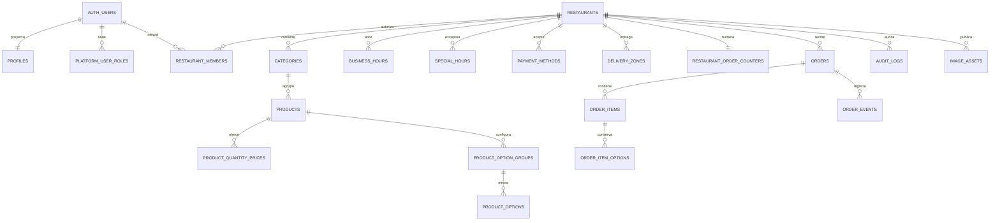
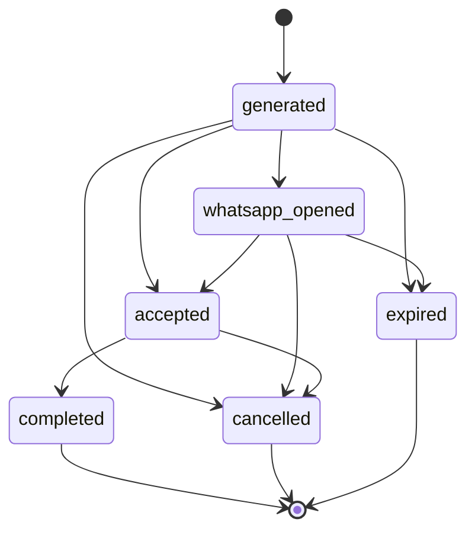

# Modelo de datos

## Convenciones

- IDs internos: UUID generados en PostgreSQL.
- Fechas operativas: `timestamptz`; horarios semanales: `time`; excepciones: `date` + `time`.
- Dinero: `bigint` en centavos, nunca `float`.
- Porcentajes: `integer` en basis points (`1000` = 10 %).
- Filas de tenant: `restaurant_id` obligatorio.
- Mutaciones normales: `created_at`/`updated_at` y trigger `private.set_updated_at`.
- Catálogo: baja lógica mediante `deleted_at`.
- Pedidos, ítems, eventos y auditoría: sin borrado físico desde roles de aplicación.

## Relaciones principales



Las claves foráneas de relaciones de tenant incluyen `(id, restaurant_id)`. Por ejemplo, un producto no puede referenciar una categoría de otro restaurante aunque un caller manipule el UUID.

## Identidad y tenancy

| Tabla | Propósito | Restricciones relevantes |
|---|---|---|
| `profiles` | Proyección privada de `auth.users` para nombre, email y estado | PK/FK a Auth; email único case-insensitive; el trigger de Auth actualiza la proyección |
| `platform_user_roles` | Roles globales | PK `(user_id, role)`; hoy solo `super_admin` |
| `restaurants` | Raíz del tenant y configuración pública | slug único y normalizado; WhatsApp E.164; colores hex; estado; moneda; prefijo de pedido |
| `restaurant_members` | Relación usuario-restaurante | `unique (restaurant_id, user_id)`; rol y estado independientes |

Un Restaurant Admin puede editar marca y configuración operativa de su tenant, pero `status`, `slug` y `order_prefix` requieren Super Admin con `aal2` o un contexto `service_role` controlado. `id`, `created_by` y `created_at` son inmutables incluso para mantenimiento administrativo; `updated_at` lo gestiona el trigger. Los grants por columna y `private.guard_restaurant_protected_fields` aplican esta separación además de RLS.

Un usuario siempre puede leer su propio perfil. Para que un Restaurant Admin lea perfiles de compañeros del tenant, tanto su membresía administrativa como su fila `profiles` deben seguir activas. Esto evita que un perfil desactivado conserve visibilidad solo porque su membresía todavía figura activa.

## Catálogo

| Tabla | Contenido | Claves e índices |
|---|---|---|
| `categories` | Nombre, slug, imagen, orden, activo y baja lógica | slug único parcial por restaurante; índice de orden público |
| `products` | Código, precios, promoción, disponibilidad, imagen y orden | código único parcial case-insensitive por restaurante; FK compuesta a categoría |
| `product_quantity_prices` | Precio total reutilizable para una cantidad exacta de 2 a 20 unidades | FK compuesta a producto; cantidad única por producto/tenant; las reglas inactivas no se publican |
| `product_option_groups` | Código de importación, grupo, obligatoriedad, mínimo/máximo y orden | FK compuesta a producto; código único por producto cuando existe; `0 <= min <= max <= 20` |
| `product_options` | Código de importación, opción y delta de precio | FK compuesta a grupo; código único por grupo cuando existe; delta no negativo |

`created_by` y `updated_by` de categorías/productos se establecen desde `auth.uid()` mediante trigger. Un producto agotado usa `available = false`; no se borra.

`save_product_catalog` guarda el producto, sus grupos, opciones, desactivaciones y, cuando el payload incluye `quantityPrices`, sincroniza esas reglas como una sola unidad. Si la propiedad no está presente —por ejemplo en importaciones existentes— conserva las reglas actuales. Valida que categoría, imagen y nodos anidados pertenezcan al tenant/producto; un error revierte todas las mutaciones de base. Subir o borrar el archivo físico de la imagen es una fase separada de Storage.

## Horarios, pagos y entrega

| Tabla | Contenido | Regla |
|---|---|---|
| `business_hours` | Uno o más turnos por día | `unique (restaurant_id, day_of_week, slot_index)`; valida cruce de medianoche |
| `special_hours` | Cierre completo o turnos excepcionales por fecha | Una excepción del día reemplaza el horario semanal; soporta turno nocturno |
| `payment_methods` | Nombre, instrucciones y ajuste porcentual/fijo | código único case-insensitive por tenant; ajustes no negativos |
| `delivery_zones` | Costo, mínimo y umbral de envío gratis | Todos los montos en centavos |
| `restaurant_order_counters` | Próximo correlativo visible por restaurante | Una fila por restaurante; incremento dentro de la transacción |
| `image_assets` | Metadata de imágenes públicas | MIME limitado; máximo 1 MiB/1200 px; path debe empezar con el UUID del tenant; `deleted_at` registra cleanup lógico best-effort |

`private.restaurant_is_open` usa la hora del servidor, zona IANA, excepciones y el turno del día anterior. `private.next_restaurant_opening` busca la próxima apertura hasta 14 días.

`save_restaurant_hours` recibe el conjunto de horarios regulares, excepciones y IDs a retirar. Verifica actor y tenant y aplica eliminaciones/upserts dentro de una sola transacción, por lo que una fila inválida revierte el guardado completo.

`list_orphan_image_assets` compara referencias de negocio, `image_assets` y `storage.objects` dentro de un tenant. Solo devuelve inconsistencias para revisión; no cambia metadata ni elimina objetos.

## Pedidos

### `orders`

Cabecera, PII de checkout, selecciones, snapshots de pago, totales, actores y tiempos de estado. Restricciones importantes:

- `action_id` UUID aleatorio y único;
- `unique (restaurant_id, idempotency_key)`;
- `unique (restaurant_id, display_number)`;
- zona y medio de pago con FK compuesta al mismo tenant;
- entrega exige zona y dirección; retiro prohíbe zona;
- `total = subtotal - discount + surcharge + delivery_fee`;
- actor y timestamp aparecen juntos;
- cancelación exige motivo;
- índices por restaurante/fecha, estado/fecha, `action_id`, vencimiento y operador.

El trigger `orders_controlled_mutations` rechaza `UPDATE` fuera de una operación SQL controlada y rechaza todo `DELETE`.

### Snapshots

| Tabla/campos | Snapshot |
|---|---|
| `orders.payment_*_snapshot` | Nombre, tipo, alcance, basis points, fijo e instrucciones del medio de pago |
| `order_items` | Código/nombre de producto, precio unitario, subtotal base canónico, modo/desglose de precio por cantidad, total de opciones, cantidad y total de línea |
| `order_item_options` | Nombre de grupo/opción y delta aplicado |

Los IDs originales se conservan cuando existen, pero editar o dar de baja el catálogo no altera la representación histórica. `order_items` y `order_item_options` son append-only.

Antes de calcular, `create_order_transaction` canonicaliza líneas con el mismo producto, conjunto de opciones y observaciones recortadas. La cantidad resultante admite hasta 100 unidades —el mismo máximo global del pedido— para que el precio no dependa de cómo el cliente haya fragmentado el carrito; variedades u observaciones distintas conservan líneas separadas.

### Timeline y auditoría

- `order_events`: transiciones, actor, metadata mínima y orden por `created_at, id`.
- `audit_logs`: acción, entidad, antes/después y metadata; opcionalmente global (`restaurant_id is null`).

Ambas tablas tienen trigger append-only. No deben contener contraseñas, JWT, tokens, headers completos ni datos bancarios sensibles.

## Esquema `private`

No está incluido en los schemas expuestos de Supabase y revoca acceso a `public`, `anon` y `authenticated`.

| Tabla | Uso | Retención operativa |
|---|---|---|
| `order_client_event_tokens` | Hash SHA-256 del token que registra apertura de WhatsApp | Uso/expiración bloquean reuso; el borrado posterior requiere el job de retención aún no versionado; nunca guarda plaintext |
| `rate_limits` | Contadores por hash/tenant/ventana | Limpiar ventanas antiguas en lotes |
| `operation_idempotency` | Resultado de operaciones administrativas reintentables | Conservar durante la ventana de reintento definida |

Los hashes de IP/teléfono llegan desde Edge Functions después de aplicar HMAC. No se persiste IP cruda.

## Numeración e idempotencia

En una creación nueva, PostgreSQL bloquea/actualiza `restaurant_order_counters` y compone `PREFIX-000001`. El número es legible, pero no se usa como secreto ni como enlace. Ante reintento, la restricción `(restaurant_id, idempotency_key)` devuelve el pedido existente sin crear ítems ni evento duplicados.

## Cálculo monetario

La transacción selecciona el precio promocional solo dentro de su vigencia y lo usa como oferta unitaria. Para cada línea calcula mediante programación dinámica la combinación exacta más barata entre unidades y reglas activas de precio por cantidad; cada regla puede reutilizarse. Los adicionales se cobran por unidad y fuera del descuento por cantidad. El cliente nunca envía el precio autorizado. Para el porcentaje positivo usa redondeo half-up a centavos:

```text
ajuste_porcentual = (base_cents * adjustment_bps + 5000) / 10000
ajuste = adjustment_fixed_cents + ajuste_porcentual
```

El descuento se limita a su base para evitar negativos. El envío gratis se decide con el subtotal. La serialización JSON expone montos grandes como texto cuando hace falta evitar pérdida de precisión; el frontend valida el rango antes de convertir a `number`.

## Estados



Las RPC de estado hacen la verificación real; el diagrama no habilita mutaciones directas.

## Migraciones

Las migraciones están ordenadas por timestamp y separan: cimientos/enums, identidad, catálogo, configuración, pedidos/privado, helpers/triggers, lectura pública, operaciones administrativas, creación de pedidos, RLS/Storage/Realtime, RPC administrativas de Edge, métricas, gestión endurecida de membresías/horarios, autorización de campos sensibles del restaurante, aislamiento de perfiles desactivados, guardados administrativos transaccionales, inventario read-only de assets inconsistentes, privilegios exactos de funciones, reemplazo seguro de coordenadas de horarios y precios por cantidad. Ejecutá siempre `supabase db reset` en local y `supabase db push` en remoto; no mantengas cambios invisibles hechos solo desde Studio.
